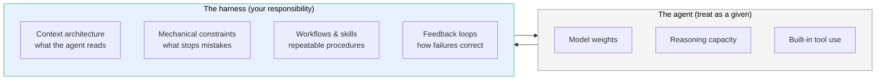
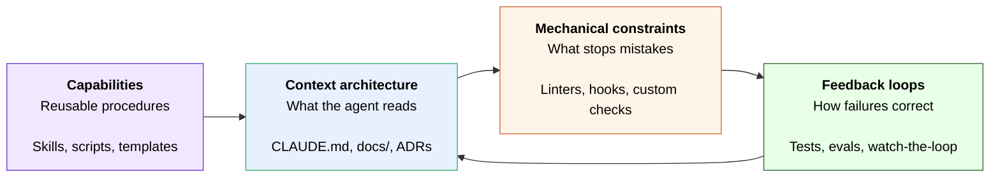

# Part I — Foundations

## 1. What harness engineering is, and what it isn't

The term *harness engineering* was coined by OpenAI in 2025 to name a discipline that practitioners had been doing informally for two years: building the environment around an AI coding agent so that the agent produces reliable, maintainable work over time.

The framing matters. Earlier discussions of AI-assisted development focused on the *agent* — better models, better prompts, better tools. Harness engineering treats the agent as a given and focuses on everything else: how context is delivered, what constraints the agent operates under, what feedback loops correct its mistakes, how knowledge persists across sessions.

> An agent without a harness is a guess generator. An agent with a harness is a force multiplier.

A working definition:

> **Harness engineering** is the discipline of designing the project environment — its documentation, tooling, constraints, and feedback loops — so an AI coding agent can produce correct, maintainable work reliably and at scale.

A few things harness engineering *is not*:

- **It is not prompt engineering.** Prompt engineering tunes a single request. Harness engineering shapes every request the agent will make over the project's lifetime.
- **It is not agent design.** You're not training a model or building tools for general use. You're equipping *your* project so *any* capable agent can work on it well.
- **It is not configuration.** A `CLAUDE.md` and a few linters is the starting point, not the destination. Harness engineering is ongoing: every agent failure is a harness improvement opportunity.
- **It is not a substitute for engineering judgment.** The harness amplifies whatever discipline you bring to it. It does not replace it.

## 2. The agent vs. the harness: a mental model

The clearest way to internalize harness engineering is to draw a hard line between the *agent* and the *harness*, and notice what falls on each side.

The arrow goes both ways for a reason. The harness *delivers* context to the agent and *receives* the agent's actions. Every part of the harness is something you build, maintain, and improve. None of it is part of the model.

Two consequences fall out of this framing:

**The agent's failures are usually your harness's failures.** When an agent reformats a file you didn't ask it to, the question isn't "why is this model bad at following instructions?" — it's "where in my harness did the rule against reformatting fail to land?" Often the rule was in prose the agent had to read and remember, not a check that would have failed mechanically. *That's a harness gap.*

**You cannot harness-engineer your way out of every problem.** If a task genuinely requires reasoning the model cannot perform, no harness fixes it. The harness amplifies; it does not transform. Knowing where the harness ends is as important as knowing where it begins.

## 3. The four primitives

Every harness, regardless of project size or stack, is built from the same four primitives. They are independent in what they do but tightly coupled in how they reinforce each other.

### Context architecture

What the agent reads when starting a task. Includes the engagement file (`CLAUDE.md`, `AGENTS.md`, `.cursorrules` — names vary), the project knowledge base (`docs/`), Architecture Decision Records, and any reference material the agent may pull in on demand.

Done well: the agent loads exactly what's needed for the current task, no more.
Done poorly: the agent loads a monolithic file containing everything and works with a polluted context the rest of the session.

Covered in **Part II**.

### Mechanical constraints

The checks that catch mistakes before they reach a human reviewer (or production). Formatters, linters, type checkers, custom project-invariant scripts, test suites — anything that runs automatically and fails when something is wrong.

Done well: each check earns its slot, and its error messages tell the agent how to fix the violation.
Done poorly: a graveyard of disabled CI jobs and false-positive-laden linters that everyone (human and agent alike) has learned to ignore.

Covered in **Part III**.

### Capabilities

Reusable procedures the agent invokes when a known workflow applies. In Claude Code these are *skills*; in other systems they may be slash commands, custom tools, or scripts. The distinction from context: capabilities are *executed*, not *read*.

Done well: high-frequency workflows are skill-wrapped so each invocation is consistent and traceable.
Done poorly: skill sprawl, where every minor task becomes a skill and the metadata budget bloats the agent's startup.

Covered in **Part IV**.

### Feedback loops

The mechanism by which the agent (and you) discover when something is wrong and correct it. Includes test failures, eval scores, build errors, and — for autonomous work — the structured research-plan-execute-verify cycle the agent walks each iteration.

Done well: failures are visible early, attributable to a specific cause, and produce harness improvements rather than just patches.
Done poorly: long-running agents grind through hundreds of iterations producing plausible-looking code that nobody verifies until much later.

Covered in **Part V**.

### Why the diagram has arrows between them

The four primitives reinforce each other in concrete ways:

- **Context → constraints.** Constraints have to reference *something*. An error message that says "see `docs/privacy-constraints.md`" only works if that document exists and is current. The constraint depends on the context.
- **Constraints → loops.** A test failure is only a useful feedback loop if the constraint that failed is clear and actionable. Constraints feed the loops.
- **Capabilities → context.** A skill that wraps a workflow is itself part of the agent's discoverable context. Skills *are* context, just delivered on demand.
- **Loops → context.** Every failure is a candidate harness improvement. Loops feed back into context updates — new ADRs, new rules, new constraints — when the failure mode is worth capturing.

A harness with strong context but weak constraints drifts — the knowledge is right, but nothing stops the agent from acting against it. A harness with strong constraints but weak loops goes stale — the checks are enforced, but failures never feed back into improving them. A harness with strong loops but weak context keeps re-deciding things that were already settled, because the reasoning was never written down. No single primitive compensates for the others; a harness improves only when all four do.

## 4. What good looks like

The hardest part of this discipline is knowing when you're done — when to stop adding harness and start letting it work. A few signals that a harness is in good shape:

- A fresh agent session orients itself in under one minute by reading the engagement file and one or two routed docs. It does not need you to re-explain the project.
- The agent rarely violates a project invariant, because the harness fails loudly when it does.
- When the agent makes a novel mistake, you can identify which harness layer should have caught it, and fixing that layer takes minutes, not hours.
- The repository alone — without your chat history, without your memory, without you in the room — is enough for someone (or some agent) to continue the project.
- You spend most of your time on the engineering, not on the agent.

A harness that isn't quite there yet looks like the inverse: every session starts with re-explanation, the same mistakes recur, errors require human translation, and the project's coherence lives in your head rather than in the repo. If that describes your current setup, the rest of this guide is for you.
