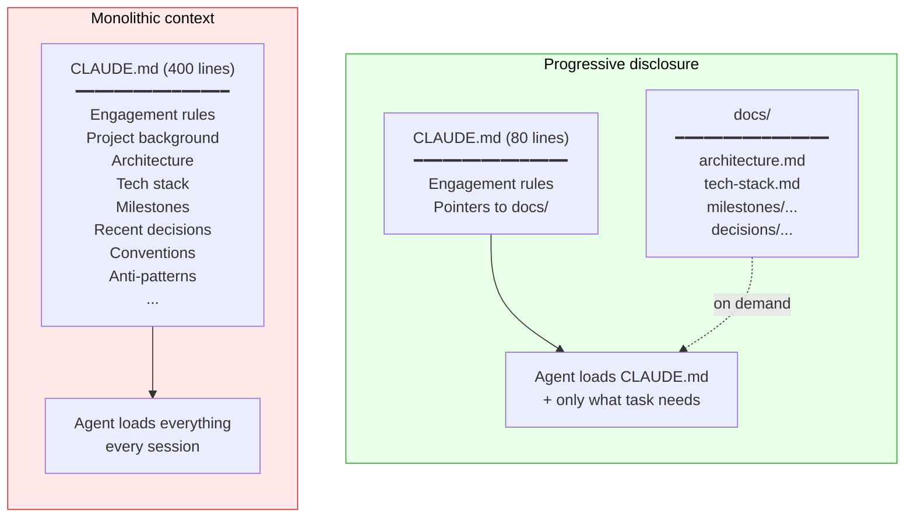

# Part II — Context architecture

> *Context is the substrate of every agent task. If it's wrong, nothing downstream can recover.*

The first thing an AI coding agent does on any task is read whatever orientation files the project provides. What lives in those files — and how they're structured — shapes every action the agent takes for the rest of the session.

This Part covers how to organize that material. It is the most important Part in this guide. Get this right and the rest of the harness has solid ground to stand on; get it wrong and no amount of constraint engineering or loop design will compensate.

---

## 5. The progressive disclosure pattern

Most projects start with a single context file — `CLAUDE.md`, `AGENTS.md`, `.cursorrules`, or whatever the current agent expects. Over time, that file grows. Project background gets added. Architecture notes get appended. Then the tech stack. Then milestone tracking. Then "rules the agent kept breaking." Then notes from the last refactor.

Three months in, the file is 400 lines long. The agent loads all 400 lines on every session, whether the current task is "fix this test" or "rewrite the deployment script." The context the agent works with is dominated by material irrelevant to the current task.

This is the failure mode every harness must avoid. The pattern that prevents it is *progressive disclosure*.

### The principle

> Load only what the current task needs. Make everything else available, but not loaded by default.

Progressive disclosure is the same idea that underlies good API design (don't expose every parameter; let advanced ones be opt-in), good UI design (collapse non-essential controls), and good documentation (front-load the basics; link to depth). Applied to agent context, it means:

- The always-loaded file contains *only* behavioral rules and a map of what else exists
- Everything else lives in separate files, loaded on demand
- The agent (or you) decides what to read based on the current task

### Why context isn't free

It's tempting to think that more context is always safer — more information means the agent is less likely to do something dumb. This is wrong, and the data is now clear:

- **Long contexts degrade reasoning quality.** Empirical work has shown that LLM performance on multi-step reasoning declines noticeably once context utilization exceeds roughly 40% of the model's window. The model is not paying equal attention to all of it.
- **Long contexts dilute attention.** Material that is *relevant* to the current task competes for the model's attention with material that *isn't*. Adding more of the latter hurts the former.
- **Long contexts cost money.** Every token in context is a token billed (and counted against rate limits) on every turn.

The combination means: a 400-line orientation file isn't safer than a 100-line one. It's *worse* on reasoning quality, *worse* on cost, and *worse* on attention to the rules that actually matter.



### Practical effect

In practice, progressive disclosure changes the agent's session in three ways:

1. **The engagement file fits on one screen.** ~80–120 lines is a healthy target. Anything longer is probably mixing engagement with knowledge.
2. **The agent learns to route.** When asked about something it doesn't see in the engagement file, it goes to the docs map and reads the relevant doc. This routing behavior is exactly what you want.
3. **Updates are local.** Changing the architecture doesn't touch the engagement file. Adding a milestone doesn't touch the architecture doc. Each file has one job and changes for one reason.

## 6. System of engagement vs. system of record

The mental model that makes progressive disclosure work is borrowed from enterprise architecture: the distinction between a *system of engagement* and a *system of record*.

| | System of engagement | System of record |
|---|---|---|
| **Question it answers** | "How should I behave right now?" | "What is true about this project?" |
| **Content** | Behavioral rules, delegation patterns, working style | Architecture, decisions, milestone state, conventions |
| **Lifecycle** | Stable; changes rarely | Evolves with the work |
| **Loaded** | Every session, always | On demand, by task |
| **Size** | Small (~100 lines) | Whatever the material requires |
| **In an agent harness** | `CLAUDE.md` / `AGENTS.md` | `docs/` |

The two have different *jobs*, different *lifecycles*, and different *audiences* — even when the audience is the same agent.

### What belongs in the engagement file

The engagement file should contain only things that change the agent's behavior on *every* task:

- **Identity and scope** — what kind of project this is, in one paragraph
- **Inviolable rules** — constraints that must hold regardless of task (security boundaries, compliance limits)
- **Delegation pattern** — when to hand off to sub-agents
- **Working style** — interaction patterns, how to communicate with the user
- **A routing map** — pointers to where deeper knowledge lives

A useful test for any line you're considering adding: *would removing this line cause the agent to behave differently?* If no, it's knowledge, and it belongs in the system of record.

### What belongs in the system of record

Everything else. Architecture diagrams, technology rationale, milestone state, design decisions, glossaries, runbooks, eval methodology, anti-patterns to avoid. Each topic gets its own file. The directory has a `README.md` that serves as the routing table.

### The routing table

The most important file in a system of record is its index — usually `docs/README.md`. The agent reads this when the engagement file points it there, and the index decides which deeper file is relevant.

### Same concept, different scope

One subtlety worth naming: both the engagement file and the system of
record contain an "orientation" section — a description of what the
project is. These look like duplicates but serve different purposes.

The engagement file's orientation is a **cold-start primer** — one
paragraph, written for an agent that has read nothing. It answers
"what am I looking at?" and points to `docs/README.md` for everything
else. It should be short enough to read in ten seconds.

The system of record's orientation is an **overview** — two to four
paragraphs, written for a contributor actively engaging with the
project. It answers "what problem does this solve, who uses it, and
what constraints shape it?" It is the foundation the rest of the docs
build on.

The distinction matters in practice: a developer writing their first
engagement file will be tempted to make the orientation as complete as
possible — "more context is safer." That instinct produces a 200-word
project description that duplicates `docs/README.md` and inflates the
always-loaded context budget. The rule: if a line in the engagement
file's orientation could live in `docs/README.md` without loss, it
belongs there.

## 7. Architecture Decision Records

The third piece of context architecture is the *Architecture Decision Record* (ADR) — a short, immutable document recording a single non-obvious design decision and the reasoning behind it.

### What an ADR is

An ADR captures four things:

1. **The context.** What situation required a decision?
2. **The decision.** What was chosen?
3. **The alternatives.** What else was considered, and why was it rejected?
4. **The consequences.** What does this commit you to maintaining?

That's it. ADRs are short on purpose. One page is typical; two pages is the upper bound. The point is durable rationale, not exhaustive analysis.

### Why ADRs matter for harness engineering

ADRs solve a problem that AI coding agents make worse: *decision evaporation*.

When a human team makes a decision, the reasoning often survives implicitly — in code review comments, in team memory, in shared context. When an AI agent helps make a decision, that implicit memory mostly doesn't form. The decision is captured in the diff; the reasoning is in a chat transcript that is gone the next time someone (or another agent) opens the project.

ADRs make the reasoning *part of the project*. The next session — yours, a teammate's, or a future agent's — can read why something is the way it is. This is the *project as source of truth* principle made concrete.

### Numbering and naming

The convention is to number ADRs sequentially with zero-padded filenames:

```
docs/decisions/
├── 0001-use-postgresql.md
├── 0002-event-driven-job-orchestration.md
├── 0003-no-graphql.md
└── README.md
```

Zero-padding (four digits) is standard practice because:

- **Lexicographic sort matches numeric sort.** `0010` sorts after `0009`, whereas `10` would sort between `1` and `2`.
- **Four digits handles any realistic project.** 9,999 ADRs is effectively unlimited.
- **Padding signals identifier, not count.** Leading zeros nudge humans and agents toward treating ADR numbers as stable IDs that should never be reused.

### Immutability — the heuristic worth internalizing

> **ADRs are append-only. Supersede with a new record; never edit history.**

This is heuristic #8 from the front page, and it's the rule new ADR practitioners most often violate. The temptation: a decision changes, so go edit the relevant ADR. Don't.

The reason: ADRs are valuable precisely because they record *what was decided, when, and why*. If you edit an ADR to reflect a new decision, you destroy the historical record of *why the original decision made sense at the time*. Six months later, when someone re-encounters the same tradeoff, they have no way to know whether the original reasoning was wrong, the constraints changed, or the team simply forgot.

The right pattern when a decision changes: write a *new* ADR that supersedes the old one. Cross-link them:

```markdown
# 0007 — Move from PostgreSQL to DynamoDB

**Status**: Accepted
**Supersedes**: 0001-use-postgresql.md
**Date**: 2026-08-12

## Context
The constraints have changed: we now need single-digit-millisecond
reads at scale, which PostgreSQL cannot deliver economically...
```

And update the old ADR's status:

```markdown
# 0001 — Use PostgreSQL for primary storage

**Status**: Superseded by 0007-move-to-dynamodb.md
**Date**: 2026-02-04
```

The audit trail of *why the project's design evolved* is now preserved. This is exactly the kind of long-horizon coherence AI-assisted projects need most.

### When to write an ADR

Not every decision needs one. ADRs are for decisions that meet at least one of:

- **More than one reasonable alternative existed.** "We picked X over Y because Z."
- **The decision affects multiple files or modules.** Cross-cutting choices benefit from a single discoverable rationale.
- **The decision encodes a constraint** (privacy, performance, compatibility) that isn't visible from any single file.
- **A reviewer would otherwise ask "why?"** ADRs preempt that question.

Don't write ADRs for trivial refactors, naming choices, or decisions that are obvious from the code itself. The bar is *non-obvious* rationale.

## 8. Anti-pattern: the monolithic context file

Most projects fail at context architecture in the same way: they let the engagement file accumulate everything, then notice the problem too late.

The progression is predictable:

1. **Week 1.** `CLAUDE.md` has 30 lines. Engagement rules, a sentence about the project.
2. **Month 1.** It's 80 lines. A few architecture notes have been added.
3. **Month 3.** 200 lines. Milestone tracking, conventions, a list of common mistakes the agent has made.
4. **Month 6.** 400+ lines. Every architectural decision the team has discussed lives somewhere in the file. Searching it takes longer than reading the relevant code.
5. **Result.** The agent's effective context window for *the actual task* has been halved by orientation material. New sessions still don't have the right context because the most-current information is buried under the most-stale.

The fix is the split this Part describes: keep the engagement file small, move knowledge into a structured directory, route on demand. The refactor is mostly mechanical, takes a few hours, and pays back immediately — every subsequent agent session is faster, cheaper, and more focused.

The principle to internalize:

> **The engagement file is a map. The system of record is the territory. Don't conflate them.**

A few smaller anti-patterns within the monolith family worth naming:

- **Status updates in the engagement file.** "Currently working on Milestone 2, Step 3" belongs in the docs index, not in the always-loaded file. Status is the most volatile content in any harness; putting it in the most-loaded file maximizes drift.
- **Anti-patterns lists in the engagement file.** "Don't use `os.remove`, use `secure_delete`" should be a *mechanical check* (Part III), not a prose rule that the agent might forget. If you find yourself adding "don't do X" lines to your engagement file, that's a signal you need a constraint, not more text.
- **Project history in the engagement file.** "We tried approach A, it didn't work; we tried B, it had issue X..." This is what ADRs are for. Engagement files capture *what to do now*, not *what was tried before*.

---

## What's next

Part II established *where* knowledge lives. Part III addresses *how rules are enforced* — the layer that prevents drift and turns prose-norms into mechanical guarantees.

The transition between them is the heuristic at the center of harness engineering:

> *If a rule matters, make it mechanical. Prose drifts, checks don't.*

That's the subject of Part III.
