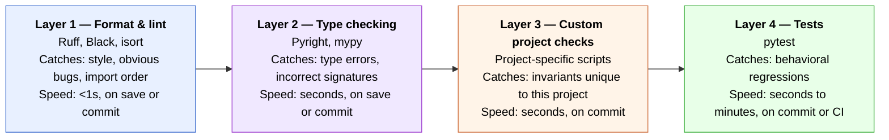

# Part III — Mechanical constraints

> *If a rule matters, make it mechanical. Prose drifts, checks don't.*

Part II established where knowledge lives. This Part addresses what happens when the agent (or you) acts against that knowledge. The answer is not to write a better rule in `CLAUDE.md`. It is to build a check that fails when the rule is violated — automatically, consistently, and with enough information to fix the violation without human translation.

This is the most operationally dense Part in the guide. It includes real configuration and real scripts. The principles are few and simple; the practice takes work to set up and pays back compounding returns once it runs.

---

## 9. Why prose rules drift, and what to do about it

Every project starts with good intentions encoded in prose. A `CLAUDE.md` or `AGENTS.md` accumulates rules like:

- "Always run `make test` before committing."
- "Don't use `dict` for API responses — use the project's typed response models."
- "New database migrations need a corresponding rollback in `migrations/`."
- "Secrets and API keys must never be hardcoded — use environment variables."

These rules are correct when written. Six weeks later, several of them have been violated — not maliciously, but because:

- The agent had a long context and didn't reach the rule before generating code.
- A new session started without the full orientation file loaded.
- The rule was ambiguous enough that the agent interpreted it differently.
- The rule was buried under thirty other rules and simply not weighted heavily.

This is not a model quality problem. It is a *mechanism* problem. Prose rules are soft — they depend on the agent reading, interpreting, and remembering them correctly on every turn. Mechanical checks are hard — they run regardless of what the agent read, regardless of session length, regardless of interpretation. They cannot be forgotten.

### The operative reframe

> Every prose rule you write is a candidate for a mechanical check. The question is not "should I write this rule?" but "is prose the right mechanism for it, or should this be a check?"

Not every rule belongs in a check. Working style rules ("give one suggestion at a time"), delegation patterns ("ask the researcher before benchmarking libraries"), and interaction norms cannot be mechanically enforced — they govern behavior, not artifacts. Those stay in prose.

But rules that govern *artifacts* — what files contain, what code does, what documentation exists — can almost always be made mechanical. The moment you find yourself writing "don't do X in file Y," ask whether a grep, an AST check, or a custom script could catch X automatically.

### The compounding return

The economics of mechanical enforcement are asymmetric in your favor:

- **Cost of writing a check:** one-time, typically 10–30 minutes for a custom script.
- **Cost of a check catching a violation:** near zero — a failed hook output in the terminal.
- **Cost of a prose rule failing to catch a violation:** debugging time, potential rework, occasional production incident.

A check written today catches the same violation forever — in every commit, by every agent, in every session, without anyone remembering to enforce it. Prose rules require re-enforcement every session. Over the lifetime of a project, five well-written checks outperform fifty prose rules.

---

## 10. Layered enforcement

Mechanical enforcement is not a single tool — it is a stack of layers, each catching different classes of violation at different speeds.



Each layer is independent. A violation caught at Layer 1 never reaches Layer 4. A violation missed at Layer 3 may or may not be caught at Layer 4 (tests catch behavioral problems, not structural ones). The layers are complementary, not redundant.

### Layer 1 — Format and lint (Ruff)

Ruff is the current standard for Python formatting and linting. It replaces Black, flake8, isort, pyupgrade, and several other tools with a single dependency and sub-millisecond execution.

Why this matters for agent-assisted development specifically: agents are not consistent about formatting. Different sessions produce different indentation choices, import orderings, and string quoting styles. Without a formatter, the diff of every agent-produced file is polluted with style noise that obscures real changes. With a formatter, the diff contains only semantic changes.

Minimal `pyproject.toml` configuration:

```toml
[tool.ruff]
target-version = "py311"
line-length = 88

[tool.ruff.lint]
select = [
    "E",    # pycodestyle errors
    "F",    # pyflakes
    "I",    # isort
    "UP",   # pyupgrade
    "B",    # flake8-bugbear
]
ignore = [
    "E501", # line too long — handled by formatter, not linter
]

[tool.ruff.format]
quote-style = "double"
indent-style = "space"
```

Two commands cover all use cases:

```bash
ruff check .          # lint: report violations
ruff check . --fix    # lint: auto-fix what's fixable
ruff format .         # format: rewrite files
ruff format . --check # format: report what would change (CI mode)
```

**The agent-specific rule:** configure Ruff to auto-fix by default in agent sessions. The agent should never have to manually fix a formatting violation — Ruff handles it, the agent moves on. Reserve `--check` mode for CI, where you want failures, not silent auto-fixes.

### Layer 2 — Type checking (Pyright)

Pyright (or mypy) catches a class of errors that linters cannot: incorrect types, missing arguments, return type mismatches. These are the errors that don't show up until runtime, and they are disproportionately likely in agent-produced code because agents pattern-match on signatures they've seen in training and occasionally produce plausible-looking-but-wrong invocations.

Minimal `pyproject.toml` configuration for Pyright:

```toml
[tool.pyright]
pythonVersion = "3.11"
typeCheckingMode = "basic"
include = ["src"]
exclude = ["tests", "migrations"]
```

Start with `"basic"` mode. `"strict"` is valuable but generates enough violations in an existing codebase that it becomes noise before you've addressed the real issues. Graduate to strict incrementally.

### Layer 3 — Custom project checks

This is the layer unique to harness engineering. Layers 1 and 2 are generic — any Python project uses them. Layer 3 is where you encode the rules specific to *this* project that no generic tool knows about.

Custom checks are the subject of the next section. The principle here is positioning: Layer 3 runs *after* formatting and type-checking, *before* the full test suite. It is cheap enough to run on every commit, specific enough to catch project-invariant violations, and fast enough not to break developer flow.

### Layer 4 — Tests (pytest)

Tests catch behavioral regressions. They are not a substitute for Layers 1–3 — a test suite cannot tell you that a file has the wrong formatting, or that a hardcoded secret was introduced in code that currently has no test coverage. Tests and checks are complementary.

For agent-assisted projects, the test suite has one additional role: it is the agent's primary feedback signal during implementation. An agent that runs tests after each change and reads the failures is operating in a tight feedback loop. An agent that writes code and only runs tests at the end is operating blind. Structure your workflow so the agent runs tests incrementally, not only at completion.

---

## 11. Pre-commit as the enforcement substrate

The four layers are useless if nobody runs them. The solution is to wire them into git so they run automatically on every commit — no manual invocation, no "did you run the linter?" conversations.

The `pre-commit` framework does this. It manages hook installation, dependency isolation, and per-tool caching in a single configuration file.

### Installation

```bash
pip install pre-commit
pre-commit install   # installs the git hook — run once per repo clone
```

After `pre-commit install`, every `git commit` triggers the configured hooks. If any hook fails, the commit is aborted and the violations are reported. The developer (or agent) fixes them and commits again.

### Configuration

The full configuration lives in `.pre-commit-config.yaml` at the repo root. A minimal but complete configuration for a Python project:

```yaml
repos:
  # Layer 1 — Ruff (lint + format)
  - repo: https://github.com/astral-sh/ruff-pre-commit
    rev: v0.4.4
    hooks:
      - id: ruff
        args: [--fix]
      - id: ruff-format

  # Layer 2 — Pyright (type checking)
  - repo: local
    hooks:
      - id: pyright
        name: pyright
        entry: pyright
        language: system
        types: [python]
        pass_filenames: false

  # Layer 3 — Custom project checks (examples)
  - repo: local
    hooks:
      - id: check-hardcoded-secrets
        name: Hardcoded secrets
        entry: python tools/check_hardcoded_secrets.py
        language: system
        pass_filenames: false

      - id: check-doc-links
        name: Documentation cross-links
        entry: python tools/check_doc_links.py
        language: system
        pass_filenames: false

  # Layer 4 — Tests (fast unit tests only on commit)
  - repo: local
    hooks:
      - id: pytest-unit
        name: Unit tests
        entry: pytest tests/ --ignore=tests/integration -x -q
        language: system
        pass_filenames: false
```

A few design choices worth noting:

**`--fix` on the Ruff lint hook.** Auto-fix applies before the commit lands. The developer sees the fix in their working tree, not a failed commit message. This is the right default for agent-assisted work — the agent shouldn't have to iterate on formatting.

**Pyright as a `local` hook.** Pyright is installed in your project's virtual environment, not managed by pre-commit's isolated environments. This is intentional — you want Pyright to see your actual dependencies, not a stripped-down environment. The tradeoff is that the developer must have Pyright installed locally (via `pip install pyright`).

**Integration tests excluded from the commit hook.** Integration tests that load real models, hit real APIs, or require specific infrastructure take too long for a commit hook. Run them in CI, not on every local commit. The `--ignore=tests/integration` flag handles this. Fast unit tests on commit; full suite in CI.

**`pass_filenames: false` on whole-project checks.** Custom checks that validate project-wide invariants (hardcoded secrets, documentation links) need to see the whole project, not just the changed files. Setting this flag tells pre-commit to run the check unconditionally rather than passing it the list of staged files.

### Running manually

Pre-commit hooks can be run on demand without committing:

```bash
pre-commit run --all-files   # run all hooks on every file
pre-commit run ruff          # run a specific hook
```

This is useful when setting up for the first time on an existing codebase — you'll want to see all violations before the first commit rather than discovering them one commit at a time.

### The skip escape hatch

Occasionally a commit legitimately needs to skip the hooks — a work-in-progress checkpoint, a merge commit, or an emergency fix. The escape hatch:

```bash
git commit --no-verify -m "wip: checkpoint"
```

**Use this sparingly.** The value of pre-commit is in its unconditional enforcement. Every `--no-verify` is a violation that slipped through. If you find yourself reaching for it regularly, the problem is a hook that's too strict or too slow — fix the hook, don't bypass it.

---

## 12. Writing remediation-grade error messages

This is the detail that separates a functional harness from an excellent one, and it is almost always underinvested.

A check that fails with a cryptic or generic message forces the developer (or agent) to diagnose the problem themselves before fixing it. A check that fails with a remediation-grade message tells them exactly what went wrong, where, and how to fix it. The second check is not just more helpful — it is faster, less error-prone, and critically, *actionable by the agent without human translation*.

### The standard to meet

Every custom check error message should answer four questions:

1. **What rule was violated?** Name the invariant, not the symptom.
2. **Where exactly?** File path and line number if applicable.
3. **Why does this rule exist?** One sentence — enough that a developer unfamiliar with the rule understands its purpose.
4. **How do I fix it?** Concrete action, not a vague gesture toward the docs.

### A bad error message

```
ERROR: Hardcoded secret detected.
```

This tells the developer that something went wrong. It does not tell them what, where, why, or how to fix it. A human developer will grep for context; an agent will produce a guess.

### A remediation-grade error message

```
HARDCODED SECRET VIOLATION
  File: src/services/payments.py, line 23
  Rule: Secrets, API keys, and credentials must never be hardcoded in
        source files. They must be read from environment variables or a
        secrets manager at runtime. Hardcoded secrets are committed to
        version control, logged in plaintext, and cannot be rotated
        without a code change.
  Found: string matching Stripe live key pattern (value redacted)
  Fix:   Replace with: stripe_key = os.environ["STRIPE_SECRET_KEY"]
         Add STRIPE_SECRET_KEY to .env.example (with a placeholder
         value) and to the project's secrets documentation in
         docs/operations.md.
         To allowlist a pattern (e.g. a test fixture using a fake key
         prefix), add it to ALLOWED_PATTERNS in
         tools/check_hardcoded_secrets.py.
  Docs:  docs/security-constraints.md
```

This message tells the agent — in a single read — what rule applies, exactly where the violation is, why the rule exists, two concrete paths to resolution, and where to find more detail. The agent can act on this without asking a follow-up question.

### Implementing remediation-grade messages in Python

Custom checks are ordinary Python scripts. The pattern is straightforward:

```python
#!/usr/bin/env python3
"""
check_hardcoded_secrets.py

Scans src/ for string literals that match common secret patterns
(API keys, tokens, credentials). Fails with a remediation message
if any are found outside of explicitly allowed patterns.
"""

import ast
import re
import sys
from pathlib import Path

# Regex patterns that suggest a hardcoded secret
SECRET_PATTERNS = [
    re.compile(r"sk_live_[a-zA-Z0-9]{20,}"),   # Stripe live key
    re.compile(r"ghp_[a-zA-Z0-9]{36}"),          # GitHub personal token
    re.compile(r"AKIA[0-9A-Z]{16}"),             # AWS access key ID
    re.compile(r"-----BEGIN (RSA|EC) PRIVATE KEY-----"),
]

# Literal strings that are explicitly allowed (e.g. fake keys in tests)
ALLOWED_PATTERNS = [
    "sk_test_",     # Stripe test keys are safe to commit
    "example",
    "placeholder",
    "your-key-here",
]

VIOLATION_MESSAGE = """
HARDCODED SECRET VIOLATION
  File: {file}, line {line}
  Rule: Secrets and credentials must never appear in source files.
        Read them from environment variables or a secrets manager at
        runtime. See docs/security-constraints.md.
  Found: string matching pattern: {pattern} (value redacted)
  Fix:   Replace with an environment variable read:
           value = os.environ["YOUR_SECRET_KEY"]
         Add the variable name with a placeholder to .env.example:
           YOUR_SECRET_KEY=your-key-here   # never commit real values
         Add the real value to your local .env (which is gitignored).
         To allowlist a test fixture, add its prefix to ALLOWED_PATTERNS
         in tools/check_hardcoded_secrets.py.
  Docs:  docs/security-constraints.md
"""


def check_file(path: Path) -> list[str]:
    violations = []
    source = path.read_text()
    try:
        tree = ast.parse(source)
    except SyntaxError:
        return violations

    for node in ast.walk(tree):
        if not isinstance(node, ast.Constant) or not isinstance(node.value, str):
            continue
        value = node.value
        if any(allowed in value for allowed in ALLOWED_PATTERNS):
            continue
        for pattern in SECRET_PATTERNS:
            if pattern.search(value):
                violations.append(
                    VIOLATION_MESSAGE.format(
                        file=path,
                        line=node.lineno,
                        pattern=pattern.pattern,
                    )
                )
                break
    return violations


def main() -> int:
    src_dir = Path("src")
    if not src_dir.exists():
        return 0

    all_violations = []
    for py_file in src_dir.rglob("*.py"):
        all_violations.extend(check_file(py_file))

    if all_violations:
        for v in all_violations:
            print(v, file=sys.stderr)
        return 1
    return 0


if __name__ == "__main__":
    sys.exit(main())
```

Notice the structure: the violation message is a module-level constant with named placeholders. This makes it easy to read, easy to update, and easy to verify that it answers all four questions before the check ships.

### The agent-readable error message as a harness artifact

This reframe is worth internalizing explicitly:

> The error message is not documentation for the developer. It is an instruction for the next agent.

When an agent runs into a failed pre-commit hook, it reads the error output and decides what to do next. A vague error produces a guess. A remediation-grade error produces a correct fix. Writing the message for the agent — not for a human who can look things up — changes what you write and how specific you make it.

---

## 13. Anti-pattern: noisy checks

The most common way a well-intentioned constraint layer degrades is through noise — checks that fire too often, fire on the wrong things, or produce messages so generic that developers learn to dismiss them.

A noisy check is worse than no check. No check is a gap; a noisy check is a gap *plus* a trained dismissal reflex. Once developers (and agents) learn that a particular check fires on false positives, they stop reading its output — and when it fires on a real violation, that violation slips through anyway.

### The five sources of noise

**1. Too broad a pattern.** A text-based grep for `"password"` will flag comments, log messages, test fixtures, and variable names like `old_password` — none of which are secrets. Prefer AST-based checks that inspect string *values* specifically, not any line that contains the word.

**2. No allowlist mechanism.** A check with no escape hatch forces developers to fight it on every legitimate exception. The result: they disable the check, not the exception. Every check should have an explicit allowlist (as in the example above) that makes exceptions visible and auditable.

**3. Enforcing style, not invariants.** A check that catches "too many blank lines between functions" is a formatter's job, not a custom check's. Reserve Layer 3 for invariants that Ruff and Pyright cannot catch. If a generic tool can enforce the rule, use it.

**4. Running too slowly.** A check that takes 30 seconds on every commit will be bypassed with `--no-verify` within a week. Custom checks should complete in under 5 seconds. If a check is slow, profile it — almost always the bottleneck is file I/O that can be narrowed by filtering to changed files.

**5. Firing on generated or vendored code.** Auto-generated files, vendored dependencies, and migration files should be excluded from all checks. A failed check on generated code is always a false positive, and the fix is always to add an exclusion — which trains developers to add exclusions reflexively, eroding the check's value on real files.

### The discipline to maintain a clean check layer

- **Review check failures in the same session they appear.** A check that fires and is dismissed becomes noise; a check that fires and produces an immediate fix is signal.
- **When a check produces a false positive, fix the check, not just the symptom.** If `check_hardcoded_secrets.py` flags a test fixture using a fake key, add the fixture's prefix to `ALLOWED_PATTERNS` and commit that change explicitly. The allowlist is documentation of deliberate exceptions.
- **Retire checks that haven't fired in six months.** A check that has never caught a real violation is either enforcing a rule that the team naturally follows (in which case the check is noise) or enforcing a rule that no longer applies (in which case the check is wrong). Either way, remove it.
- **Every new check gets a review before merging.** Ask: does this check earn its slot? What is the false-positive rate on the existing codebase? What does the error message tell the next developer?

---

## What's next

Part III established the enforcement layer that gives the context architecture from Part II its teeth. The combination — structured knowledge, mechanical enforcement — covers two of the four primitives.

Part IV turns to the third: *capabilities*. Where context is what the agent reads and constraints are what stops mistakes, capabilities are the reusable procedures that make high-frequency workflows consistent and traceable — and the discipline of knowing when to wrap a workflow in a skill versus when to leave it as a documented process.
