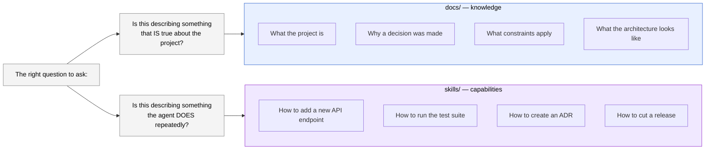

# Part IV — Agent capabilities (skills)

> *Skills are for workflows; docs are for knowledge. The wrong mechanism is worse than no mechanism.*

Parts II and III covered what the agent reads (context) and what stops it from acting wrongly (constraints). This Part covers the third primitive: reusable procedures — the workflows the agent executes repeatedly, which deserve to be captured, standardized, and made auto-discoverable rather than re-derived from scratch on every invocation.

In Claude Code, these are called *skills*. Other agent systems call them slash commands, custom tools, or playbooks. The name varies; the concept is the same: a packaged, reusable procedure the agent can invoke consistently without requiring you to re-explain it every session.

---

## 14. Skills vs. docs: when each is the right tool

The distinction between skills and docs is one of the most commonly confused points in harness engineering, because both use progressive disclosure and both live outside the always-loaded engagement file. The difference is not structural — it is functional.



### The operative test

Ask one question about any candidate piece of content:

> **Is this describing something that *is* true about the project, or something the agent *does* repeatedly?**

- "We use PostgreSQL for primary storage" → *is* true → `docs/tech-stack.md`
- "When adding a new database migration, follow these steps..." → *does* repeatedly → a skill
- "All API responses must include a request correlation ID" → *is* true → `docs/architecture.md`
- "When creating an ADR, use this template and update the index" → *does* repeatedly → a skill

The test fails at the edges — some content genuinely straddles both. When in doubt, ask a second question: *would I want the agent to auto-discover this, or do I want to explicitly invoke it?* Auto-discovery is the skill mechanism; explicit reference is the doc mechanism.

### Why the wrong mechanism is worse than no mechanism

This is heuristic #4, and the second half — "the wrong mechanism is worse than no mechanism" — is the part that surprises people.

If you put workflow instructions in `docs/`, they don't auto-trigger. The agent reads the doc when you point it there, gets the instructions, and follows them — or doesn't, depending on context pressure. The instructions exist but lack teeth.

If you put project knowledge in a skill, you've created something worse: a skill that auto-triggers on keyword matches, injecting project-knowledge content into unrelated tasks. A skill named "architecture" with a description broad enough to match "system design" might inject your architecture notes into a session about fixing a failing test — polluting the context with irrelevant material and degrading the agent's focus on the actual task.

The directionality matters:

- **Docs that should be skills** → the agent re-derives the workflow from scratch each time, produces inconsistent results, and you re-explain the same procedure repeatedly. Frustrating, but recoverable.
- **Skills that should be docs** → the agent injects knowledge into wrong contexts, inflates the always-loaded metadata budget, and produces subtly wrong behavior that is hard to diagnose. Harder to recover from.

When uncertain, default to a doc. You can promote to a skill later once the workflow is stable and proven to recur. You cannot easily un-ring the bell of a badly-scoped skill that has been triggering in wrong contexts for two months.

### What makes something a good skill candidate

Three conditions, all of which should be true:

1. **High frequency.** The workflow recurs across multiple sessions. A workflow you have done twice may not yet be stable enough to wrap; one you have done ten times has likely revealed its edge cases.

2. **Non-obvious steps.** The workflow has steps that are not derivable from first principles — gotchas, project-specific conventions, ordering constraints that matter. If the agent could reconstruct the procedure correctly from the codebase alone, the skill adds less value.

3. **Consistency matters.** The result should be the same regardless of who (or which agent session) runs it. Database migrations should follow the same structure. API endpoints should follow the same naming and error-handling conventions. ADRs should use the same template. Skills enforce that consistency mechanically.

If all three are true, make it a skill. If only one or two are true, a doc is probably sufficient.

---

## 15. Writing a skill that auto-triggers correctly

A skill has two distinct parts: the *trigger* (the metadata that tells the agent when to invoke the skill) and the *content* (the instructions the agent follows once invoked). Both need care, but they fail in opposite directions — trigger problems cause wrong invocations; content problems cause wrong executions.

### Anatomy of a skill file

In Claude Code, skills live in `.claude/skills/<skill-name>/SKILL.md`. The file follows a specific structure:

```
---
name: add-api-endpoint
description: >
  Use this skill when adding a new REST API endpoint to the service.
  Triggers include: "add an endpoint", "new route", "new API method",
  "expose X via API". This skill covers the full workflow: route
  definition, handler implementation, input validation, error handling,
  and test coverage. Does NOT apply to modifying existing endpoints.
---

# Add a new REST API endpoint

## When to use this skill
...

## Steps
...

## Gotchas
...

## Verification
...
```

The frontmatter `description` is what the agent reads to decide whether to invoke the skill. The body is what the agent reads after invoking it.

### Writing the trigger description

The description has one job: match the right tasks and reject the wrong ones. Four principles:

**Be specific about the task class, not the domain.** "Use when adding a new REST API endpoint" is specific. "Use for API-related tasks" is too broad — it would match debugging an endpoint, reviewing API documentation, or benchmarking latency, none of which need this skill.

**Include trigger phrases explicitly.** The agent matches descriptions against the user's request. Listing likely phrasings — "add an endpoint", "new route", "new API method" — increases reliable triggering without broadening the scope.

**Exclude adjacent tasks explicitly.** If there is a nearby task that might false-trigger, name it: "This skill is for *adding* new endpoints, not for *modifying* existing ones or *documenting* the API." Adjacent exclusions prevent the most common false-positive.

**Keep it to 3–5 sentences.** The description is read on every session to determine relevance. Long descriptions inflate the always-loaded metadata budget; short ones scan quickly. The description is advertising, not documentation — its job is accurate routing, not complete explanation.

### Writing the skill content

Once triggered, the skill body is the agent's procedure. It should read like a senior engineer's handoff note to a capable colleague: complete enough to execute correctly without supervision, specific enough to catch the non-obvious edge cases.

A complete skill body has four sections:

**When to use this skill** (one short paragraph). Restates the trigger condition in slightly more detail than the description. Helps the agent — and you — verify the skill was invoked correctly before proceeding.

**Steps** (numbered list). The procedure in order. Each step should be a single action with enough specificity to execute without guessing. Don't collapse two distinct actions into one step.

**Gotchas** (bulleted list). The non-obvious things that a capable engineer would still get wrong without project-specific knowledge. This is the highest-value section — it is where the skill justifies its existence over a generic doc.

**Verification** (short list). How to confirm the workflow completed correctly. For a code-producing skill, this is usually "run these tests" and "confirm these files were updated." The verification step closes the loop — the agent knows it is done when verification passes, not when it runs out of steps.

### A complete skill example

The following example is for a project that uses FastAPI and follows a specific internal convention for endpoint structure. The gotchas section is where the project-specific knowledge lives — the steps themselves are generic enough that any API project could adapt them.

```markdown
---
name: add-api-endpoint
description: >
  Use this skill when adding a new REST API endpoint to the service.
  Triggers: "add an endpoint for X", "new route", "expose X via API",
  "new API method". Does NOT apply to modifying existing endpoints,
  adding middleware, or documenting the API.
---

# Add a new REST API endpoint

## When to use this skill

When the project needs a new route that does not yet exist. Use this
skill for both simple CRUD endpoints and more complex multi-step
handlers; the structure is the same in both cases.

## Steps

1. Define the route in the appropriate router file under `api/routers/`.
   Group related endpoints in the same router; create a new router file
   only if the resource is genuinely new.

2. Define a Pydantic request model in `api/models/requests.py` and a
   response model in `api/models/responses.py`. Do not use raw dicts
   for request or response bodies.

3. Implement the handler function. Handlers must not contain business
   logic — delegate to a service function in `services/`. The handler
   is responsible only for: parsing the request, calling the service,
   and formatting the response.

4. Add error handling for the expected failure modes. Use the project's
   `raise_http_error()` helper rather than constructing `HTTPException`
   directly — it ensures the error response matches the standard schema.

5. Register the router in `api/main.py` if it is new.

6. Write tests in `tests/api/` covering: the happy path, at least one
   validation error case, and at least one service-layer error case.

## Gotchas

- Route paths use kebab-case, not snake_case. `/user-preferences` not
  `/user_preferences`. The linter catches this, but it is faster to
  get it right the first time.

- The `raise_http_error()` helper expects an error code from
  `api/errors.py`, not a raw HTTP status integer. Using a raw integer
  bypasses the error catalog and breaks the standard error response
  schema.

- Pydantic v2 is in use. Field aliases, validators, and model config
  syntax differ from v1. If you see `@validator` in existing code, that
  is legacy — use `@field_validator` for new code.

- Tests that hit the database must use the `db_session` fixture, not
  `db` — the latter does not roll back between tests.

## Verification

- `pytest tests/api/ -x` passes with no regressions.
- New tests cover the happy path, one validation error, and one service
  error.
- `ruff check . && ruff format --check .` passes.
- The new endpoint appears in the OpenAPI schema at `/docs`.
```

### The skill as a living document

Skills are not static once written. The gotchas section in particular should grow as the team — or the agent — encounters new edge cases. The right cadence: after any session where a skill is used and reveals something non-obvious, add a gotcha. Over time the skill becomes more valuable with each project iteration, accumulating the institutional knowledge that would otherwise evaporate between sessions.

---

## 16. Anti-pattern: skill sprawl

The opposite failure from under-using skills is over-using them — creating a skill for every task, including ones that do not meet the three conditions for a good skill candidate. The result is *skill sprawl*: a `.claude/skills/` directory with dozens of skill files, most of which trigger rarely or incorrectly, all of which inflate the metadata budget the agent reads on every session.

### How sprawl happens

Skill sprawl typically follows a predictable arc:

1. A team discovers skills and finds them powerful.
2. They skill-wrap the obvious high-frequency workflows (good).
3. They skill-wrap some medium-frequency workflows "just in case" (neutral).
4. They skill-wrap one-time setup tasks, research prompts, and reminder notes that belong in docs (bad).
5. The skill directory has 30 files. The agent's startup metadata budget is saturated. Descriptions start to overlap and compete, causing false triggers. The team stops maintaining skills that don't fire, but doesn't remove them because "we might need them."
6. The skills layer produces more noise than signal.

### The three signals of sprawl

**Descriptions that overlap.** If two skills have descriptions that could both trigger on the same user request, one of them is wrong. Either they cover different tasks (sharpen the descriptions) or they cover the same task (merge them).

**Skills that have not fired in a month.** A skill the agent never invokes is either redundant (the agent handles the task without it), replaced (a different skill covers it), or mis-described (the trigger never matches). Any of these is a reason to retire or fix it.

**Skills that contain mostly knowledge, not procedure.** A skill file that reads like a doc — lots of "this project uses X because Y" rather than "step 1, step 2, step 3" — is a doc that was placed in the wrong location. Move it to `docs/` and remove the skill.

### The maintenance discipline

- **Audit the skill directory quarterly.** Check trigger frequency, description overlap, and content drift.
- **Retire aggressively.** Removing a skill that is not earning its slot is costless — if it turns out to be needed, it can be recreated. Keeping a sprawled skill directory has ongoing costs on every session.
- **One skill per cohesive workflow.** If two procedures always happen together, they are one workflow. If they sometimes happen independently, they are two workflows. Don't split the former; don't merge the latter.
- **Keep descriptions honest.** A description that overpromises — triggering on tasks the skill doesn't actually help with — is worse than no skill. The agent reads it, invokes the skill, and produces a result shaped by content that didn't apply. Update descriptions whenever the scope of a workflow changes.

---

## What's next

Part IV covered the third primitive — capabilities that make high-frequency workflows consistent and traceable. The fourth and final primitive is the feedback loop: the mechanism by which both the agent and the harness itself learn from failures and improve over time.

Part V takes on the discipline of designing loops you can watch, the research-plan-execute-verify cycle, and the question that underlies every autonomous-agent decision: how much autonomy is the right amount, and how do you know when you have crossed the line?
