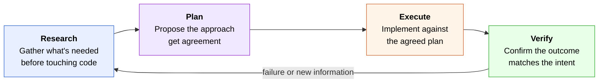
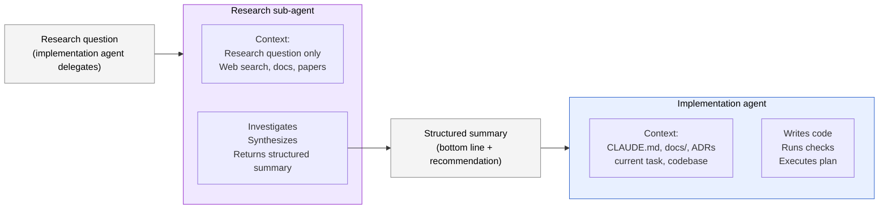
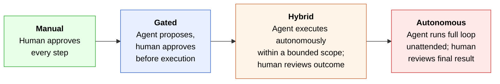

# Part V — Feedback loops

> *The harness fails where you aren't looking.*

The first three primitives — context, constraints, and capabilities — are all preventive. They reduce the probability that the agent does something wrong. The fourth primitive, feedback loops, is corrective: it determines how quickly the agent (and the harness itself) discovers and recovers from mistakes when they happen anyway.

A harness without feedback loops is a one-way street. Instructions flow in, code flows out, and errors accumulate silently until a human notices something is wrong. A harness with well-designed feedback loops is a cycle: failures surface quickly, produce actionable signal, and feed improvements back into the harness so the same failure doesn't recur.

This Part covers the four things that make feedback loops work: a disciplined execution cycle, sub-agent specialization, observable loop design, and a clear-eyed view of the autonomy spectrum.

---

## 17. Research-plan-execute-verify as a discipline

The most common failure mode in agent-assisted development is not bad code — it is premature code. The agent is asked to implement something, jumps straight to writing files, and produces an implementation that solves the wrong problem, uses the wrong abstraction, or contradicts a decision already captured in the project's ADRs.

The fix is structural: impose a four-phase cycle before any significant implementation begins.



### Research

Before writing a line of code, the agent gathers what it needs to make good decisions: the relevant docs from the project's knowledge base, any prior ADRs that constrain the design space, and any external information (library behavior, API contracts, compliance requirements) that affects the approach.

Research is cheap. A session that spends five minutes reading `docs/architecture.md` and two relevant ADRs before coding will produce better output in less total time than one that codes immediately and discovers the constraints mid-implementation.

The research phase also determines whether an investigation should be delegated. Some questions — library comparisons, external API behavior, compliance requirements — are better answered by a specialist sub-agent with a clean context than by the implementation agent pausing to research mid-task. This is covered in the next section.

### Plan

Before executing, the agent proposes an approach and gets agreement. The plan does not need to be elaborate — a short description of what will change, what files will be touched, and what the result will look like is enough. The purpose is to surface misunderstandings before they become diffs.

Two things the plan phase catches that execution alone cannot:

- **Wrong problem.** The agent's interpretation of the task differs from what was intended. Catching this in a paragraph costs nothing; catching it after 200 lines of code is expensive.
- **Constraint violations.** The proposed approach contradicts an existing ADR, a mechanical constraint, or a pattern already established elsewhere in the codebase. Reading the plan takes seconds; undoing a committed implementation takes much longer.

In practice, the plan phase is often a single message: "Here's what I propose to do — does this match what you intended?" The value is in the pause, not the formality.

### Execute

With research complete and a plan agreed, the agent implements. The execution phase is where most harness engineering effort traditionally focuses — formatters, type checkers, custom checks — and those are necessary. But the research and plan phases upstream make the execute phase dramatically cheaper: the agent is implementing a specific, agreed, constraint-checked plan rather than exploring a solution space.

One discipline that matters specifically during execution: **run checks incrementally, not only at the end.** An agent that runs the test suite after each meaningful change catches regressions immediately and with minimal context. An agent that implements everything and then runs tests at the end faces a complex diagnostic problem when something fails.

### Verify

After execution, the agent confirms the outcome matches the intent. Verification has two components:

- **Mechanical verification:** the full check stack passes — formatter, type checker, custom invariants, test suite. This is non-negotiable. An implementation that passes all checks but fails mechanical verification is not complete.
- **Intent verification:** the output actually solves the problem described in the plan phase. Mechanical checks confirm correctness of the implementation; intent verification confirms correctness of the *specification*. These are different checks and both matter.

When verification fails, the loop restarts — not necessarily from scratch, but from the phase where the failure reveals a gap. A test failure sends the agent back to execute. A discovered constraint violation sends it back to plan. New information about the problem sends it back to research.

### The loop as a harness artifact

The research-plan-execute-verify cycle is not just a workflow — it is a *harness artifact*. Encoding it in the engagement file (`CLAUDE.md`) means the agent follows it on every significant task without being reminded. Encoding it in a skill means it can be invoked explicitly for tasks where the overhead is warranted.

The overhead is worth it. A session that skips the research and plan phases to save time almost always spends that time back at the debugging end of the execute phase, where it costs more.

---

## 18. Sub-agents as context firewalls

The second mechanism that makes feedback loops work is sub-agent specialization — dividing work between agents with different contexts, different tools, and different scopes.

The key insight is in the framing: sub-agents are not primarily about parallelism or capability. They are about **context isolation**. The implementation agent's context should contain implementation-relevant material. Research, investigation, and synthesis introduce material that is relevant to the research question but irrelevant — and actively distracting — to the implementation task that follows.



### What sub-agents isolate

When an implementation agent pauses to research — reading documentation, comparing libraries, investigating external behavior — it pollutes its own context with material that is relevant to the research question and irrelevant to the implementation. This has two costs:

- **Attention dilution.** The model's attention is now split between implementation context and research material. The research material may influence code generation in ways that are subtle and wrong.
- **Context window pressure.** Research output is often verbose. A detailed investigation of three library options, read in full, can consume a substantial fraction of the implementation agent's context window — leaving less room for the codebase, the ADRs, and the actual task.

A sub-agent reads the research question, investigates it in a clean context, and returns a *structured summary* — typically a short document with a bottom line, key findings, and a specific recommendation. The implementation agent reads the summary, not the raw research. The research context stays isolated.

### What to delegate and what to handle directly

Not every question warrants a sub-agent. The cost of delegation is coordination overhead — framing the question, waiting for the response, reading the summary. For questions the implementation agent can answer quickly from existing project context, delegation adds latency without adding value.

A simple rule: delegate when the answer requires **going outside the project**. Library comparisons, external API behavior, compliance requirements, benchmark data, security patterns — these require information that isn't in the codebase and would require significant context to gather inline. Handle directly when the answer is in the project's existing docs, ADRs, or code.

| Delegate to sub-agent | Handle directly |
|---|---|
| Comparing two libraries for a use case | Which file contains the database schema |
| Current compliance requirements for a regulation | What an existing function does |
| Benchmarking a new model or tool | Whether a test covers a specific case |
| Security patterns for a new integration | What an ADR decided |
| Any "how does X work?" about an external system | Debugging a failing test |

### The structured summary as the handoff artifact

The quality of the sub-agent's output determines the value of the delegation. A research result that dumps raw findings — "I found these five things" — forces the implementation agent to synthesize and decide, which is work that should have happened in the research context. A structured summary that leads with a bottom line and a specific recommendation gives the implementation agent exactly what it needs to proceed.

A minimal effective structure:

```
## Research summary: [topic]

**Bottom line:** [one sentence — the key finding the implementation agent needs]

**Recommendation:** [specific, actionable, tailored to this project]

**Key findings:**
- Finding 1 (with confidence level or source)
- Finding 2
- ...

**Caveats:** anything uncertain, outdated, or requiring verification
```

The implementation agent reads the bottom line and recommendation. If it needs more detail, it reads the key findings. The raw investigation stays in the research agent's context — it does not travel to the implementation session.

### Archiving research

Research summaries are durable. The investigation into "which library should we use for X" is just as relevant six months from now when someone asks the same question. Archiving research output to a `research/` directory at the repo root means future sessions can consult prior investigations rather than re-running them.

This is the *project as source of truth* principle applied to research: the answer to a question the project has already investigated should live in the project, not in someone's memory or a chat transcript that no longer exists.

---

## 19. Designing loops you can watch

Autonomous loops — where the agent iterates through research-plan-execute-verify without waiting for human input at each step — are the highest-leverage mode of agent-assisted development. They are also the mode where harness failures are most expensive: a poorly designed loop running unattended will compound mistakes across dozens of iterations before anyone notices.

The discipline of loop design is not about limiting autonomy. It is about making loops *observable* — structured so that failures surface quickly, are attributable to a specific cause, and produce harness improvements rather than just patches.

### The first-iterations rule

> **Watch the first iterations of any autonomous loop carefully. The harness fails where you aren't looking.**

This is heuristic #10, and the practical implication is specific: when you start a new autonomous loop, do not walk away immediately. Watch the first three to five iterations. You are looking for:

- **Scope drift.** The agent is doing more (or less) than the task specifies. Scope drift caught at iteration two is a plan problem; caught at iteration twenty it is a much larger rework problem.
- **Check failures that the agent is papering over.** An agent that silences a failing test rather than fixing the underlying issue will produce a green check suite that hides broken behavior. This is visible in the first iteration if you're watching; invisible if you're not.
- **Unexpected tool use.** The agent is reading or modifying files outside the expected scope. This is often benign but sometimes indicates a misunderstanding of the task that will compound.
- **Runaway context growth.** Each iteration is loading progressively more context, and the agent's output quality is degrading. This is a loop design problem — the iteration scope is too large, and the loop needs to be restructured around smaller units of work.

If the first few iterations look clean — the agent is doing the right thing, checks are passing, scope is correct — the loop is probably safe to leave. If anything looks off, stop and fix the harness before continuing.

### Stop conditions

Every autonomous loop needs an explicit stop condition — a definition of "done" that the agent can evaluate without human input. Without one, the loop either runs indefinitely or stops arbitrarily.

Three types of stop condition, from most to least preferred:

**Mechanical:** the loop stops when a specific check passes. "Run until the full test suite passes with no failures" is a mechanical stop condition. It is unambiguous, evaluable without human judgment, and naturally aligned with the verification phase of the execution cycle.

**Iteration-bounded:** the loop stops after N iterations regardless of outcome. "Run for at most ten iterations, then report status." This is a safety net, not a primary stop condition — it prevents runaway loops when the mechanical condition is not being reached. Always combine with a mechanical condition: "run until tests pass, or for at most ten iterations, whichever comes first."

**Time-bounded:** the loop stops after a wall-clock duration. Less useful than iteration-bounded because iteration cost varies; a ten-minute limit might be two iterations or fifty depending on what the agent is doing. Use time bounds only when iteration count is unpredictable.

### Logging for observability

A loop that runs without producing a human-readable trace of what it did is a black box. When it finishes (or fails), you cannot tell which iterations were productive, where it got stuck, or what the harness should have caught.

Minimal useful logging for an autonomous loop:

```python
# At the start of each iteration
log.info(f"Iteration {n}: starting — current state: {state_summary}")

# After each check runs
log.info(f"Iteration {n}: {check_name} {'passed' if ok else 'FAILED'}")

# At each decision point
log.info(f"Iteration {n}: decided to {action} because {reason}")

# At loop exit
log.info(f"Loop complete after {n} iterations: {outcome}")
```

The log does not need to be elaborate. It needs to be structured enough that you can read it after the fact and reconstruct what happened. A log that says "iteration 7: tests failed, retrying" is sufficient; a log that says only "working..." is not.

### Designing for failure

A well-designed loop treats failure as signal, not just outcome. When an iteration fails — a check does not pass, the output does not match the intent — the loop should:

1. **Record the failure specifically.** Not "something went wrong" but "the `test_user_creation` test failed with `AssertionError: expected 201, got 400`."
2. **Pause before retrying.** Immediately retrying the same action that just failed is almost always wrong. The loop should re-enter the research or plan phase with the failure as new information.
3. **Bound the retries.** Three failed attempts at the same fix is a signal that the approach is wrong, not that the agent needs more tries. The loop should escalate — either to a different approach or to human review — rather than continuing to iterate.

A loop that treats failures this way produces a log that is itself a harness improvement guide: every recorded failure is a candidate for a new mechanical check.

---

## 20. The hybrid autonomy spectrum

Autonomous loops are powerful and expensive — in time, in context budget, and in the cost of mistakes that compound unobserved. The right level of autonomy for a given task is not "as much as possible" — it is "as much as the harness can safely support."



### The four levels

**Manual** — the human approves every individual action before the agent executes it. Appropriate when exploring an unfamiliar codebase, when the task involves irreversible actions (production deployments, data migrations), or when the harness is not yet mature enough to catch the agent's mistakes reliably. Expensive in human time; cheap in mistake cost.

**Gated** — the agent proposes a plan and the human approves it before execution begins. The execution itself is autonomous within the approved plan. Appropriate for well-scoped tasks in a known codebase with a mature harness. This is the default for design-heavy work: design decisions are made with human input, implementation is autonomous.

**Hybrid** — the agent runs a bounded autonomous loop on a well-defined task, and the human reviews the outcome. The loop has explicit stop conditions, iteration limits, and sufficient logging that the review is meaningful rather than "it says it worked, I'll take its word for it." Appropriate for tasks that are well-understood, well-constrained, and have strong mechanical verification (a passing test suite is the canonical example).

**Autonomous** — the agent runs a full loop unattended from problem statement to verified solution. Appropriate only when the harness is mature, the task class is well-understood, the stop condition is mechanical, and the cost of a mistake is low and reversible. Rarely the right choice for novel or design-heavy work; well-suited to routine tasks like dependency updates, test coverage gaps, or documentation generation.

### Choosing the right level

The right level is determined by four factors:

**Harness maturity.** A young harness — one that has not yet been exercised enough to reveal its gaps — does not safely support autonomous operation. Every harness gap that would be caught by a human reviewer in gated mode becomes an unobserved mistake in autonomous mode. Invest in the harness before escalating autonomy.

**Task familiarity.** A task class the agent has performed many times in this codebase, with a known pattern and known failure modes, is safer to run autonomously than a novel task. The first time the agent implements a new kind of feature, use gated mode. The tenth time, hybrid may be appropriate.

**Reversibility.** How expensive is a mistake? A mistake in a test file is cheap to reverse — revert the change and try again. A mistake in a database migration script or an infrastructure-as-code file may be expensive or irreversible. Scale autonomy inversely with reversal cost.

**Mechanical verification quality.** The stronger the mechanical verification — the more completely the check suite can confirm that the output is correct — the safer autonomous operation is. A task with full test coverage and a comprehensive check suite can be verified mechanically. A task where "correct" requires human judgment cannot.

### The common mistake: escalating too fast

The most common harness engineering mistake is not choosing too little autonomy — it is escalating to autonomous operation before the harness is ready to support it.

The pattern: a team gets comfortable with gated operation, sees that the agent is performing well, and switches to autonomous loops to save time. The first few loops go well. Then a loop runs into an edge case the harness does not catch, produces incorrect output, and the team discovers the mistake three days later when downstream code fails. The investigation reveals that a mechanical check would have caught the mistake immediately — but nobody had written it yet because the gated operation had been masking the gap.

The discipline: **treat every autonomous loop failure as a harness gap, not an agent failure.** The question after every mistake is not "why did the agent do that?" but "what check should have caught it, and why didn't we have that check?" Every answer is a harness improvement. Over time, the harness becomes mature enough to support broader autonomy safely — but that maturity is earned incrementally, not assumed.

---

## What's next

Part V completed the four primitives: context, constraints, capabilities, and feedback loops. Together they describe a harness that delivers the right information, enforces the right rules, packages the right workflows, and learns from its own failures.

Part VI steps back from the individual primitives to address operating discipline — the practices that keep a harness healthy across sessions, tools, and the inevitable evolution of both the project and the models working on it.
