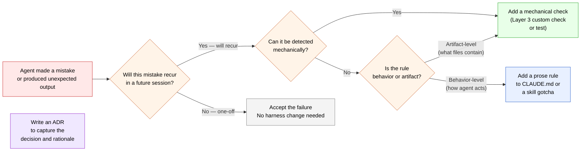

# Part VI — Operating discipline

> *The repo outlives the session, the model, and the conversation.*

The five Parts before this one described what to build: context architecture, mechanical constraints, capabilities, and feedback loops. This Part describes how to operate what you've built — the practices that keep a harness healthy across the inevitable churn of sessions, model updates, team changes, and project evolution.

A harness that is well-designed on day one but never maintained degrades into the same monolithic, drift-prone setup it replaced. Operating discipline is what prevents that. It is less glamorous than building the harness, and more important than building it correctly the first time.

---

## 21. Handoffs between sessions and tools

Every agent session begins with a cold start. The model has no memory of prior sessions; it knows only what the current context provides. This is the most underestimated cost in agent-assisted development — not the per-token price, but the accumulated friction of re-orienting an agent that should already know the project.

A well-designed harness minimises cold-start cost. A poorly designed one externalises it onto the developer, who must re-explain context on every session. The difference compounds: three re-orientations per week across a year is more than 150 sessions spent on setup instead of work.

### The two types of handoff

**Session handoff** — starting a new conversation with the same agent system on the same project. This happens constantly: every time you close a chat, hit a rate limit, or switch from design to implementation mode.

**Tool handoff** — moving work between different interfaces or agent systems. Design discussion in a chat interface, implementation in an IDE-integrated agent, review in a code-review tool. Each has different strengths; moving between them is inevitable and, without a disciplined handoff, lossy.

### What a handoff transfers

The temptation is to summarise the conversation — to replay the reasoning, the false starts, the decisions that were reconsidered. Resist it. A handoff that transfers conversation history transfers noise alongside signal.

What a handoff should transfer is *state*, not *history*:

- **What the project is** — a pointer to the project's orientation docs, not a re-explanation of them. If the docs are current, a single line ("this is the payments-api project — see `docs/README.md`") is enough.
- **What was decided** — references to ADRs that were created or consulted in this session, with a one-line note on why they're relevant to the current task.
- **What the current task is** — the specific, bounded piece of work the next session should continue. Not "we're working on the API" but "implement the `POST /users` endpoint per the plan in `docs/milestones/m2.md`, sections 3 and 4."
- **What's blocking or uncertain** — any open questions or discovered constraints that the next session needs to be aware of before proceeding.

Four items. A well-written handoff is a single short document, typically half a page. Its job is to put a fresh agent session in the position of a capable colleague who just read the relevant docs and is ready to work — not in the position of someone who sat through the whole preceding conversation.

### The handoff as a harness artifact

The most effective handoff is not ad-hoc — it follows a template that the team (or a skill) produces consistently. A template-driven handoff has three benefits:

- **It is complete.** A template with four required sections cannot accidentally omit the current task or the blocking questions.
- **It is scannable.** A fresh agent session reads a consistent structure faster than a bespoke summary.
- **It is improvable.** When a handoff fails — the next session still doesn't have the context it needed — the failure is attributable to a specific missing section, and the template is updated.

A minimal handoff template:

```markdown
## Handoff — [date]

**Project:** [name + pointer to docs/README.md]

**Current task:** [specific, bounded description of what to work on next]

**Decisions made this session:**
- [ADR reference or one-line summary of each significant decision]

**Open questions / blockers:**
- [anything the next session needs to resolve before proceeding]

**Engagement rules:** see CLAUDE.md — one step at a time, wait for <<go>>
```

### Tool handoffs and the cost of switching

Moving between a chat interface and an IDE-integrated agent is the most common tool handoff. The two have genuinely different strengths:

- **Chat interfaces** are better for design, deliberation, and exploratory discussion. Long context, fast turns, no file-system access required.
- **IDE-integrated agents** are better for implementation, refactoring, and anything that requires reading or writing files. Direct access to the codebase, inline diff review, integrated test runners.

The discipline: **use the right tool for the current phase, and make the handoff explicit.** An implementation task that stays in a chat interface pays the cost of copy-pasting code; a design discussion that migrates into an IDE agent pays the cost of the agent reading files it doesn't need. The handoff document is what makes the switch clean.

The broader principle: **the project docs, not the tool, should be the source of continuity.** A handoff from chat to IDE should work because the IDE agent can read `docs/README.md`, `CLAUDE.md`, and the relevant ADRs — not because the handoff document replayed everything. If the project docs are current, the handoff document can be short. If they're not current, no handoff document is long enough to compensate.

---

## 22. Keeping the harness evolving instead of drifting

A harness that is not actively maintained drifts. Docs go stale as the codebase changes. Checks that once caught real violations start firing on false positives and get disabled. Skills that once reflected the project's conventions fall out of sync as conventions evolve. The engagement file accumulates new prose rules that should have been mechanical checks.

Drift is not a failure of discipline — it is the natural state of any artifact that is not maintained. The question is not whether drift will happen but whether the team has practices that detect and reverse it before it becomes expensive.

### The four drift patterns

**Documentation drift** — `docs/` describes a system that no longer exists. Architecture docs reference components that were removed; milestone docs claim exit criteria that were quietly abandoned; ADRs describe constraints that were superseded without a new ADR being written.

*Detection:* the freshness check (Part III) catches files that haven't been touched in a configurable period. The more reliable signal is when a fresh agent session produces output that contradicts the docs — that is always a sign that either the docs or the code is wrong.

*Repair:* update docs as part of the same commit that changes the code. A commit that changes an architectural component without updating `docs/architecture.md` is incomplete. Make this a team norm, or encode it as a pre-commit check.

**Check drift** — mechanical checks that were once meaningful have become noise. A check fires on false positives; the team learns to ignore it. A check enforces a pattern that the project has moved away from; it now flags legitimate code. A check was written for a constraint that no longer applies.

*Detection:* track how often each check fires and what proportion of fires are false positives. A check with a false-positive rate above 10–15% is producing more noise than signal and needs to be fixed or retired.

*Repair:* fix or retire. A broken check is worse than no check — it trains the team to ignore failures. Retiring it honestly is better than leaving it in place and dismissed.

**Skill drift** — skills describe workflows that have evolved. A skill that once reflected the team's conventions for adding a new endpoint now produces code that doesn't match how the codebase has developed. The skill is invoked, the agent follows it, and the output is technically correct but stylistically inconsistent.

*Detection:* when a skill-produced output requires significant post-processing to match the project's current patterns, the skill is drifting. When the gotchas section stops being surprising — when every senior engineer already knows not to do the things it warns against — the skill may have served its purpose and can be simplified or retired.

*Repair:* update skills in the same session where their gap is discovered. A session that uses a skill and finds it missing a gotcha should add the gotcha before closing. The skill as a living document is only valuable if it is actually updated.

**Autonomy drift** — the team has gradually escalated to autonomous operation without consciously deciding to, and the harness has not kept pace. Loops that started gated are now running unattended; checks that were adequate for gated operation are not catching the mistakes that autonomous operation introduces.

*Detection:* autonomous loops producing surprising output, or output that requires significant human correction after the fact. The loop's logging becomes the detection mechanism — a log that shows the agent repeatedly retrying the same failed approach is a signal that the stop condition or the check suite is inadequate.

*Repair:* step back one level on the autonomy spectrum until the harness gaps are addressed. This is not a failure — it is a calibration. The harness matures by discovering and closing gaps, and that process requires being able to see the gaps.

### The update discipline

Four lightweight practices that prevent drift without becoming bureaucratic:

**Update docs in the same commit as the code they describe.** Never split "change the thing" and "update the docs for the thing" into separate commits. Splitting them means the docs are wrong between the two commits, and "I'll update the docs separately" becomes "I forgot to update the docs."

**Write ADRs before implementing, not after.** An ADR written after implementation is a post-hoc justification, not a decision record. The value of the ADR is in the plan phase of the execution cycle — the act of writing it often reveals constraints or alternatives that change the implementation. Written after, it captures what happened but cannot influence it.

**Review the skill directory quarterly.** Fifteen minutes per quarter is enough to identify skills that haven't fired, skills with stale gotchas, and skills that have drifted from the current conventions. It is not enough time to let skill sprawl accumulate undetected.

**Treat every fresh-session re-explanation as a docs gap.** When a new agent session requires you to explain something that should be in the project docs, stop — update the docs, then continue. Every re-explanation is evidence that the system of record is incomplete. Closing that gap immediately costs two minutes; leaving it open costs the same explanation every session.

---

## 23. When to add a check vs. a rule vs. accept the failure

Not every problem the agent encounters warrants a harness response. Adding a check, a prose rule, or an ADR all have costs — maintenance overhead, false-positive risk, contributor confusion — and those costs must be weighed against the benefit. The discipline is knowing which response, if any, is warranted.



### The decision tree in plain language

**Will this mistake recur?** A mistake that happened because of an unusual task, a transient misunderstanding, or a one-time edge case does not warrant a harness change. Adding a check for every mistake the agent has ever made produces check sprawl; adding a rule for every edge case produces an unreadable engagement file. The bar for a harness change is *recurrence* — the mistake is a predictable consequence of how the task class is structured, not a random error.

**Can it be detected mechanically?** If yes, a check is almost always the right answer — even if writing the check takes longer than writing a prose rule. A check that catches the mistake on the next occurrence is worth the investment. A prose rule that might be forgotten is not.

**Is it behavior or artifact?** If the mistake is about how the agent *acts* — the sequence of steps it follows, the questions it asks, the way it communicates — a prose rule in the engagement file or a skill gotcha is the right mechanism. Mechanical checks enforce what files contain; they cannot enforce conversational behavior. If the mistake is about what *artifacts* the agent produces — the content of files, the structure of outputs, the presence or absence of required elements — a check is the right mechanism.

**ADRs are for decisions, not mistakes.** An ADR is warranted when a mistake reveals that a non-obvious design decision was never documented — so future sessions will encounter the same decision point and lack the reasoning to make it correctly. The ADR captures the decision; the check or rule prevents the mistake. Often both are needed: write the ADR first (to document the decision), then write the check (to enforce it).

### Accepting failures

Accepting a failure — making no harness change — is a legitimate outcome of this decision tree, not a failure of discipline. A harness that adds a check for every agent mistake will accumulate technical debt in the harness itself: overfitted checks, noisy rules, and a skills directory full of gotchas for one-time situations.

The standard for acceptance: the failure was a one-off, caused by conditions that are unlikely to recur, and the cost of a harness change exceeds the expected cost of the failure happening again. These cases exist. Recognising them is part of the discipline.

---

## 24. The cost picture

Harness engineering is not free, and understanding the cost structure matters for making good decisions about where to invest and how much autonomy to exercise.

### Where costs come from

**Context costs.** Every token in the agent's context window is billed on every turn. A bloated context — from a monolithic engagement file, from research material that should have stayed in a sub-agent, from skills that triggered incorrectly — inflates per-turn cost and degrades output quality simultaneously. Context discipline is not just a performance concern; it is a cost control mechanism.

**Autonomous loop costs.** An autonomous loop iteration reads context, makes tool calls, produces output, and runs checks — each of which consumes tokens. A loop that runs twenty iterations on a medium-complexity task may consume ten to fifty times the tokens of a single focused manual session. The token cost of a loop is not proportional to the task complexity; it is proportional to the number of iterations, which is determined by how quickly the stop condition is reached.

**Mistake costs.** A mistake caught by a mechanical check costs the price of the failed commit. A mistake caught by a human reviewer costs review time plus the rework. A mistake that reaches a deployed system costs considerably more. Investing in checks moves cost from the expensive end of this spectrum to the cheap end.

**Maintenance costs.** Every check, skill, and ADR is a maintenance artifact. It will need to be updated when the project evolves. A harness with fifty checks, thirty skills, and a hundred ADRs has a real ongoing maintenance cost. This is not a reason to avoid building a harness — the maintenance cost of a good harness is lower than the accumulation cost of a bad one — but it is a reason to be selective and to retire artifacts that no longer earn their place.

### Rate limits and budget controls

Most agent systems impose rate limits — caps on usage within a rolling window. For autonomous loops especially, rate limits are a real operational constraint. A loop that runs into a rate limit mid-execution must be designed to resume cleanly, not restart from scratch.

Three practices that keep costs predictable:

**Monitor usage actively.** Most agent platforms expose current usage against the limit. Check it before starting a long autonomous loop; check it mid-loop if the task is significant. The goal is not to stay as far from the limit as possible — it is to never be surprised by a limit when the work is at a critical point.

**Budget per task, not per session.** Before starting an autonomous loop, estimate the expected token cost and check that the estimate fits within the remaining budget. A loop expected to take fifteen iterations that would consume the entire remaining weekly budget is a loop that should be broken into smaller scoped tasks.

**Use cheaper models for routine tasks.** Most platforms offer models at different capability and price points. Routine tasks — formatting fixes, documentation updates, dependency bumps, test coverage gaps — do not require the most capable model. Reserving expensive models for tasks that genuinely require strong reasoning is a straightforward cost control practice.

### The compounding return on harness investment

The cost picture is asymmetric in one important way: harness investment compounds.

A check written today catches the same mistake in every future session, forever. A skill that packages a workflow makes every future invocation of that workflow cheaper and more consistent. An ADR that captures a design rationale prevents every future session from re-litigating the same decision.

The cost of a harness investment is one-time. The return is per-session, indefinitely. Projects that invest early in harness engineering consistently spend less time on agent management over their lifetime than projects that defer it — not because the harness prevents all mistakes, but because the mistakes it does prevent are the high-frequency, high-cost ones that compound most aggressively without intervention.

---

## What's next

Part VI completes the guide's main content. What remains are the appendices — practical reference material for putting the guide's principles into practice.

- **Appendix A** — Reference toolchain: minimal viable configurations for Ruff, Pyright, pre-commit, and pytest, ready to drop into a new project.
- **Appendix B** — Templates: the engagement file skeleton, `docs/README.md` skeleton, ADR template, skill template, and handoff template referenced throughout the guide.
- **Appendix C** — Further reading: the source material this guide draws on, for readers who want to go deeper on any of the primitives.
